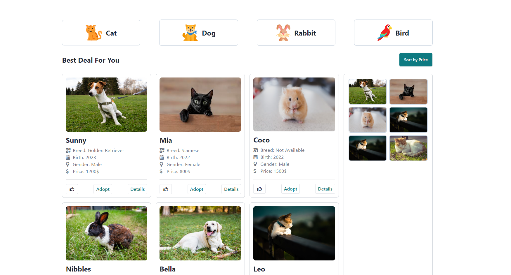

# 
A Peddy Shop

## Description:

Welcome to Peddy Shop, your one-stop destination for finding the perfect furry companion! Whether you’re looking for a playful cat, a loyal dog, or a cuddly rabbit, we’ve got a wide selection of pets ready to bring joy to your home. At Peddy Shop, we prioritize the health and happiness of every animal, ensuring you get a happy, healthy pet along with expert care tips and supplies.

## 5 key features of the project:

1. Toggle Navbar Design
2. Dynamic Category Button
3. Category wise animal show
4. 2 type modal showing
5. Dynamic data included in the individual animal card
6. Like button click of card and added the image in the side div.

## ES6 features:

1. Arrow function
2. Fetch API
3. Destructuring data
4. Asynchronous function
5. setTimeOut function

[Github Repository Link](https://github.com/programming-hero-web-course2/b10a6-pet-adoption-shamsuttabriz)

[Project Live Link](https://sh-peddy-shop.netlify.app/)
